# From Raw Data to Business Insights: Building a Customer Churn Analysis Pipeline

## Introduction

In today's data-driven business landscape, understanding why customers leave is as critical as knowing how to acquire them. This article explores a comprehensive customer churn analysis pipeline built for a telecommunications company, from database design to actionable insights.

The project demonstrates how modern data engineering principles can transform raw customer data into actionable business intelligence, integrating SQL Server, Python, scikit-learn, and visualization tools into a cohesive analytical framework.

## Architecture Overview




The system is built on four main components:

1. **Data Acquisition & Storage**: SQL Server database with a normalized schema optimized for analytical queries
2. **Data Lakehouse**: Multi-layer storage architecture combining flexibility and performance  
3. **Data Processing Pipeline**: Python-based ETL process with robust error handling
4. **Analysis Framework**: Modular Python functions for cohort identification and business insights generation

## Database Design Philosophy

The database implements a 3NF (Third Normal Form) design within a dedicated `TelcoChurnQ3` schema, creating clear separation between:

- Dimension tables (Locations, PaymentMethods, ContractTypes)
- Fact tables (CustomerBilling, CustomerChurnHistory)
- Junction tables (CustomerServices, CustomerContract)

```sql
CREATE TABLE TelcoChurnQ3.CustomerInfo (
    CustomerID NVARCHAR(50) NOT NULL PRIMARY KEY,
    Gender BIT, 
    Age INT,
    /* ... */
    Status VARCHAR(50) CHECK (Status IN ('Churned', 'Stayed', 'Joined')),
    SatisfactionScore INT CHECK (SatisfactionScore BETWEEN 1 AND 5),
    CLTV INT,
    /* Foreign keys */
    LocationID INT,
    CONSTRAINT FK_LocationID FOREIGN KEY (LocationID) 
        REFERENCES TelcoChurnQ3.Locations(LocationID)
);
```

This design enables efficient querying for different analysis dimensions while maintaining data integrity.

## Data Storage & Warehousing

The solution implements a modern lakehouse architecture, combining the flexibility of data lakes with the structured querying capabilities of traditional warehouses:

1. **Staging Area**: Raw data is initially loaded into temporary tables for validation
2. **Transformation Layer**: Clean, validated data moves to the normalized schema
3. **Export/Import Pipeline**: BCP utility enables high-performance data transfer

### BCP & Format File Generation

The pipeline automatically generates Binary Copy Program (BCP) files and format descriptor files to optimize bulk data operations:

```powershell
# Generate format files for each table 
$tables = @("CustomerInfo", "CustomerBilling", "CustomerServices", "CustomerContract")
foreach ($table in $tables) {
    $formatFile = "$ProjectRoot\Datasets\$table.fmt"
    bcp "CustomerChurnDB.TelcoChurnQ3.$table" format nul -c -f $formatFile -t, -S $ServerInstance -T
    Write-Host "Created format file: $formatFile" -ForegroundColor Green
}
```

These format files define column mappings and data types, enabling reliable high-speed data transfer between various components of the system.

Transformed Data Pipeline
The system follows a multi-stage approach to data transformation:

Python script processes and cleanses raw data, producing a standardized CSV file
SQL Server's BULK INSERT operation utilizes custom format files to load data at high velocity
Integrity constraints and checks are applied during import to ensure data quality

```sql
-- High-performance data import using format files
BULK INSERT #TelcoData
FROM @FilePath
WITH (
    FORMATFILE = @ROOTDIR + 'telco_format.fmt',
    FIRSTROW = 2,
    TABLOCK,
    FIELDTERMINATOR = ',',
    ROWTERMINATOR = '\n',
    ERRORFILE = @ROOTDIR + 'error.log'
);
```

Lakehouse Schema Design
The underlying database implements a lakehouse paradigm with three distinct layers:
1. **Raw Zone**: Unaltered data stored in staging tables with minimal transformation
2. **Curated Zone**: The normalized 3NF schema housing cleansed, validated data
3. **Consumption Zone**: Pre-aggregated views and materialized tables optimized for analysis

This architecture combines the flexibility of data lakes with the performance of traditional warehouses, enabling both exploratory analysis and structured reporting from the same data foundation.


## Data Processing Pipeline

The ETL workflow handles data from raw CSV files to analytical datasets:

1. **Extraction**: Automated SQL bulk operations to efficiently load raw data
2. **Transformation**: Python processing for feature engineering and standardization
3. **Loading**: Write-back to database with comprehensive error handling

```python
# Feature engineering example
df['Revenue_Per_Month'] = df['Total_Revenue'] / df['Tenure_in_Months']
df['Total_Extra_Charges'] = df['Total_Extra_Data_Charges'] + df['Total_Long_Distance_Charges']
df['Extra_Charges_Pct'] = df['Total_Extra_Charges'] / df['Total_Revenue'] * 100
```

The pipeline includes robust validation and error handling, logging all operations for auditing and debugging.

## Customer Segmentation with Advanced Clustering

The core analytical approach uses unsupervised learning to identify distinct customer segments:

```python
# KMeans clustering with hyperparameter optimization
pipe = Pipeline([
    ("scaling", StandardScaler()),
    ("reduce_dim", "passthrough"),  # Will be replaced during grid search
    ("clustering", KMeans(random_state=42, n_init=10))
])

param_grid = {
    "reduce_dim": [PCA(), FactorAnalysis()],
    "reduce_dim__n_components": np.arange(5, 20, 5),
    "clustering__n_clusters": np.arange(5, 11, 2)
}
```

The clustering process automatically identifies the optimal dimensionality reduction technique and cluster count using silhouette scoring. This leads to more stable and interpretable customer segments.

## Cohort Analysis Framework

Once customer segments are identified, the framework enables deep analysis across five key dimensions:

1. **Demographics Analysis**: Geographic and household composition patterns
2. **Contract Services Analysis**: Service combinations and their relationship to churn
3. **Tenure and Charges Analysis**: Revenue patterns and customer lifetime value
4. **Payment Method Analysis**: Payment behavior and churn risk
5. **Satisfaction Analysis**: Customer sentiment and retention correlation

Each dimension uses standardized analytical techniques:

```python
def DemographicsAnalysis(df: pd.DataFrame) -> None:
    """
    Analyzes demographic characteristics of customer clusters with a focus on Cluster 1.
    
    Business Context:
    - Customer demographics strongly influence product preferences and churn risk
    - Geographic concentration of high-risk customers enables targeted regional campaigns
    - Family status affects service bundle decisions and price sensitivity
    - Age distribution reveals potential generational technology adoption barriers
    - Understanding demographic patterns allows for more personalized retention strategies
    """
```

## Data Visualization Strategy

The project employs a custom `Plot` class to ensure visualization consistency:

```python
# Delegate class for plotting data
class Plot:
    def __init__(self, figsize=(16,10), nrows=1, ncols=1, title=None):
        self.fig, self.ax = plt.subplots(nrows, ncols, figsize=figsize)
        self.title = title
        self.fig.suptitle(self.title, fontsize=16) if self.title else None
        # Additional initialization...
```

This approach allows for creating complex visualizations while maintaining consistent styling.


## Key Findings 

The analysis revealed several important patterns:

1. **High-Risk Segment Profile**: The highest-churn customer segment (Cluster 1) showed specific characteristics:
   - Month-to-month contracts (72% of churned customers)
   - Electronic check payment methods (83% higher churn rate)
   - Fiber optic internet with minimal additional services

2. **Service Adoption Impact**: Customers with security-related services (online security, backup, protection) showed 67% lower churn rates.

3. **Geographic Concentration**: High-churn customers clustered in specific cities, enabling targeted retention campaigns.

4. **Price Sensitivity**: Customers with charges 15-20% above segment average had double the churn rate.

## Implementation and Operations

The project includes infrastructure-as-code elements for repeatable deployment:

```powershell
# Database installation PowerShell script
$Database = "CustomerChurnDB"
$Files = @(
    "SQLQuery_ImportRawData.sql", 
    "SQLQuery_3NF.sql", 
    "CohortAnalysis.py",
    "SQLQuery_ImportTransformedData.sql"
)
```

This approach ensures the entire pipeline can be replicated across environments.

## Best Practices and Lessons Learned

1. **Modular Design**: Breaking analysis into focused functions improved maintainability
2. **Database Performance**: Normalized schema with appropriate indexes enabled faster queries
3. **Error Handling**: Comprehensive logging at all stages simplified troubleshooting
4. **Parameter Management**: Centralized configuration simplified administration
5. **Visualization Consistency**: Standardized plotting framework improved communication
6. **Lakehouse Architecture**: Combining data lake flexibility with warehouse performance improved both exploration and reporting capabilities

## Conclusion

This customer churn analysis pipeline demonstrates how disciplined data engineering practices enhance business intelligence outcomes. By combining robust data management, advanced machine learning, and focused business analysis, we've created a system that transforms raw customer data into actionable retention strategies.

The modular architecture allows for easy extension to additional data sources and analytical techniques, providing a scalable foundation for ongoing customer insight generation.

---

*This project was developed using Python 3.10 with scikit-learn 1.2.1, pandas 2.0.3, and SQL Server 2019.*